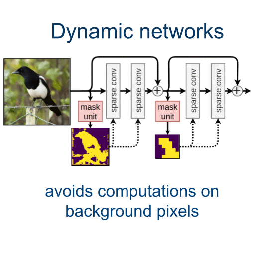

# Dynamic Convolutions - DynConv
Pytorch code for DynConv. DynConv applies convolutions on important regions of the image only, and thus reduces the computational cost while speeding up inference up to 2 times. 

[https://arxiv.org/abs/1912.03203](https://arxiv.org/abs/1912.03203)

> Dynamic Convolutions: Exploiting Spatial Sparsity for Faster Inference  
> Thomas Verelst and Tinne Tuytelaars  
> CVPR 2020  

## Classification
* [https://github.com/thomasverelst/dynconv/classification/](https://github.com/thomasverelst/dynconv/tree/master/classification)
* ResNet on CIFAR-10 and ImageNet (only masks, no efficient CUDA impl.)

## Human Pose Estimation
* [https://github.com/thomasverelst/dynconv/pose/](https://github.com/thomasverelst/dynconv/tree/master/pose)
* Stacked Hourglass on MPII - with fast CUDA implementation of DynConv for depthwise convolutions of the MobileNetV2 residual block

## Coming later (~August-September)
* Classification with efficient MobileNetV2

